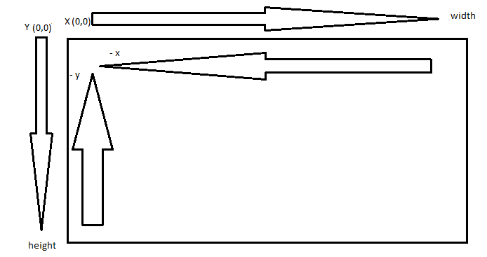
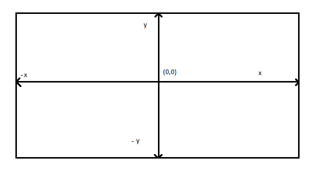

# 3D Desmytifie

is a pratice to learn 3d rendering in 2d to video of [tscoding]

# 3D Penger Model

This is a simple 3D model of a penger,`penger.js`, created using JavaScript and HTML5 canvas. The model is made up of vertices and faces, which are defined in the `script.js` file. The vertices are projected from 3D to 2D using a simple perspective projection, and then drawn on the canvas.

# script.js

is a simple projection of 3D points to 2D, and drawing them on the canvas. The vertices and faces of the model are defined in the `pangerVertices` and `pangerFaces` arrays, respectively. The `draw` function is called in a loop to continuously render the model on the canvas. The `clear` function is used to clear the canvas before each new frame is drawn. The `point` function is used to draw the vertices of the model, and the `line` function is used to draw the edges between the vertices. The `project` function is used to convert 3D points to 2D points, and the `screen` function is used to convert normalized coordinates to screen coordinates.

# projection
the projection is a simple perspective projection, which is defined by the following formula:

the vectors x and y are divided by the z vector to create a perspective effect, where objects that are farther away appear smaller. see 

transform the 3D point to 2D point

```
(x, y, z) → (x/z, y/z)
```


# function `screen(point)`

this function converts normalized coordinates HTML-Canvas to screen coordinates, see .

origin top left corner

- Positive X → to the right

- Negative X → to the left

- Positive Y → down

- Negative Y → up


the function `screen` convert the coordinates to ther origin in the center of the screen, and invert the y axis to match the screen coordinates. see



# function `rotate_xz()`

this functions rotate around y axis

tscoding explain He gives a brief explanation of how to rotate the first object you've created. He also notes that if you want a more in-depth understanding, you can watch the following video [rotation matrix].

[rotation matrix]: https://www.youtube.com/watch?v=EZufiIwwqFA
[tscoding]: https://www.youtube.com/watch?v=qjWkNZ0SXfo
